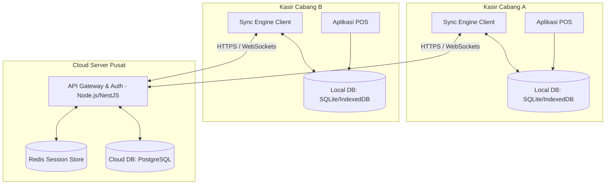
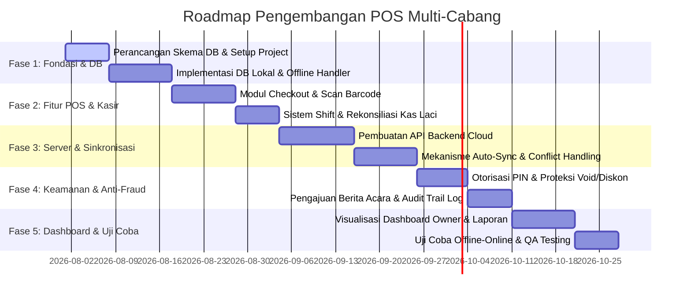

# CETAK BIRU ARSITEKTUR & SPESIFIKASI FUNGSIONAL
## SISTEM POS & MANAJEMEN TOKO MULTI-CABANG OFFLINE-FIRST DENGAN ANTI-FRAUD SYSTEM

**Versi:** 1.0.0  
**Status:** Siap Eksekusi (Ready to Execute)  
**Peran Pembuat:** Senior Full-Stack Software Engineer & System Architect  
**Tanggal:** 24 Juli 2026  

---

## 1. PENDAHULUAN & TUJUAN SISTEM

Sistem ini dirancang untuk mengelola **3 cabang toko secara terpusat** dengan pendekatan **Offline-First**. Tujuan utamanya adalah memastikan operasional kasir (Point of Sales) tetap berjalan 100% tanpa gangguan meskipun koneksi internet terputus, sekaligus menjaga keamanan finansial dan inventaris melalui sistem deteksi & proteksi fraud (kecurangan) yang dikendalikan penuh oleh Master Admin (Owner).

### Pilar Utama Sistem:
1. **Zero Downtime POS:** Transaksi kasir dan scan barcode tidak boleh bergantung pada koneksi internet.
2. **Strict Stock Isolation:** Pencegahan kebocoran informasi stok antar-cabang untuk menjaga integritas data operasional masing-masing kasir.
3. **Master Admin Centralized Control:** Visibilitas konsolidasi real-time atas performa 3 cabang serta log audit fraud terpusat.
4. **Anti-Fraud Security:** Penutupan celah manipulasi harga, kas, berita acara stok, dan void transaksi.

---

## 2. ARSITEKTUR OFFLINE-FIRST & SYNC MECHANISM

### 2.1 Arsitektur Sinkronisasi (Client-Server)

Sistem menggunakan database lokal (IndexedDB melalui Dexie.js di browser/PWA, atau SQLite di aplikasi desktop Electron) pada setiap perangkat kasir di masing-masing cabang. Database lokal bertindak sebagai *source of truth* operasional harian kasir.



### 2.2 Mekanisme Deteksi Koneksi & Queueing

1. **Heartbeat Checker:** Client mengirimkan request ringan (ping) ke server setiap 10 detik. Jika gagal 3 kali berturut-turut, status beralih ke `OFFLINE`.
2. **Mutation Queue:** Setiap operasi tulis (insert/update) di client saat offline dicatat dalam tabel lokal `mutation_queue` yang memiliki skema:
   * `id`: UUID (Primary Key)
   * `table_name`: Nama tabel target (misal: `sales`, `void_logs`)
   * `action`: `'INSERT'` | `'UPDATE'` | `'DELETE'`
   * `payload`: JSON data yang akan disinkronkan
   * `created_at`: TIMESTAMP
3. **Auto-Sync Process:** Ketika status kembali `ONLINE`, Sync Engine memulai proses *Flush Queue*:
   * Mengirimkan mutasi secara berurutan sesuai urutan waktu (`created_at` ASC).
   * Menggunakan transaksi batch untuk efisiensi bandwidth.
   * Setelah server membalas dengan status sukses, data dalam `mutation_queue` dihapus atau ditandai `synced = true`.

### 2.3 Resolusi Konflik Data (Conflict Resolution)

* **Sales & Cash Flow (Append-Only):** Tidak ada konflik karena data penjualan bersifat unik per mesin kasir (menggunakan format ID: `TX-BRANCH_ID-DEVICE_ID-YYYYMMDDHHMMSS-RANDOM`). Server hanya melakukan *append* (insert).
* **Master Data (Products, Prices, Users) - Server-Wins:** Data master hanya dapat diubah di server oleh Master Admin. Client secara berkala menarik pembaruan (*pull-sync*). Jika ada perbedaan data produk lokal vs server, data server secara otomatis menimpa data lokal.
* **Stok (Delta-Based Sync):** Penyesuaian stok dilakukan menggunakan operasi delta (+/-) bukan nilai absolut, untuk menghindari penimpalan stok yang tidak akurat jika sinkronisasi tertunda.

### 2.4 Backup Otomatis & Disaster Recovery

* **Database Server:** Backup otomatis dilakukan setiap tengah malam (00:00 UTC+7) menggunakan utility `pg_dump`. Hasil backup dienkripsi dengan AES-256 dan diunggah ke Google Cloud Storage / AWS S3 dengan kebijakan retensi 30 hari.
* **Database Lokal Kasir:** Snapshot database lokal dicadangkan ke penyimpanan lokal terpisah (misal folder cadangan pada disk internal perangkat kasir) setiap kali kasir melakukan Tutup Shift.

---

## 3. SKEMA DATABASE (DATA MODEL & INDEXING)

Untuk menjamin skalabilitas, integritas data, dan kecepatan pencarian, skema database dirancang dengan relasi yang ketat dan index yang optimal.

### 3.1 Skema Database Lokal (SQLite / IndexedDB)

#### Tabel: `users`
| Nama Kolom | Tipe Data | Constraint | Keterangan |
| :--- | :--- | :--- | :--- |
| `id` | UUID | PRIMARY KEY | ID unik user |
| `username` | VARCHAR(50) | UNIQUE, NOT NULL | Username login |
| `password_hash` | VARCHAR(255) | NOT NULL | Hash BCrypt/Argon2 |
| `pin_hash` | VARCHAR(255) | NOT NULL | Hash PIN 6-digit untuk otorisasi cepat |
| `role` | VARCHAR(20) | NOT NULL | `'MASTER_ADMIN'` \| `'CASHIER'` |
| `branch_id` | UUID | NULLABLE | Terisi jika role = CASHIER |
| `is_active` | BOOLEAN | DEFAULT TRUE | Status keaktifan akun |

#### Tabel: `products`
| Nama Kolom | Tipe Data | Constraint | Keterangan |
| :--- | :--- | :--- | :--- |
| `id` | UUID | PRIMARY KEY | ID produk |
| `barcode` | VARCHAR(50) | UNIQUE, NOT NULL | Barcode EAN-13 / UPC |
| `name` | VARCHAR(100) | NOT NULL | Nama barang |
| `category` | VARCHAR(50) | | Kategori produk |
| `selling_price` | DECIMAL(12,2) | NOT NULL | Harga jual normal |
| `cost_price` | DECIMAL(12,2) | NOT NULL | Modal/Harga beli (Moving Average Cost) |
| `max_discount` | DECIMAL(5,2) | DEFAULT 10.00 | Batas diskon maksimal tanpa otorisasi (%) |
| `updated_at` | TIMESTAMP | NOT NULL | Waktu pembaruan terakhir |

#### Tabel: `inventories` (Strict Branch Isolation di level Lokal)
*Catatan: Pada DB lokal kasir, tabel ini hanya berisi data stok milik cabang tempat kasir bertugas.*
| Nama Kolom | Tipe Data | Constraint | Keterangan |
| :--- | :--- | :--- | :--- |
| `product_id` | UUID | PRIMARY KEY, FK | Relasi ke `products.id` |
| `branch_id` | UUID | PRIMARY KEY | ID Cabang saat ini |
| `stock` | INT | NOT NULL, DEFAULT 0 | Jumlah stok fisik saat ini |

#### Tabel: `sales`
| Nama Kolom | Tipe Data | Constraint | Keterangan |
| :--- | :--- | :--- | :--- |
| `id` | VARCHAR(50) | PRIMARY KEY | ID Transaksi unik |
| `branch_id` | UUID | NOT NULL | ID Cabang asal transaksi |
| `cashier_id` | UUID | NOT NULL | ID Kasir yang bertugas |
| `member_id` | UUID | NULLABLE | Relasi ke CRM/Member |
| `subtotal` | DECIMAL(12,2) | NOT NULL | Total sebelum diskon |
| `total_discount`| DECIMAL(12,2) | NOT NULL | Total potongan harga |
| `grand_total` | DECIMAL(12,2) | NOT NULL | Nilai akhir yang dibayar |
| `payment_method`| VARCHAR(20) | NOT NULL | `'CASH'` \| `'QRIS'` \| `'DEBIT'` \| `'RECEIVABLE'` |
| `cash_received` | DECIMAL(12,2) | DEFAULT 0 | Jumlah uang tunai diterima |
| `cash_change` | DECIMAL(12,2) | DEFAULT 0 | Kembalian |
| `created_at` | TIMESTAMP | NOT NULL | Waktu transaksi dibuat |
| `synced` | BOOLEAN | DEFAULT FALSE | Status sinkronisasi ke cloud |

#### Tabel: `sale_items`
| Nama Kolom | Tipe Data | Constraint | Keterangan |
| :--- | :--- | :--- | :--- |
| `id` | UUID | PRIMARY KEY | ID detail item |
| `sale_id` | VARCHAR(50) | FK, NOT NULL | Relasi ke `sales.id` |
| `product_id` | UUID | FK, NOT NULL | Relasi ke `products.id` |
| `quantity` | INT | NOT NULL | Jumlah item dibeli |
| `price_at_sale` | DECIMAL(12,2) | NOT NULL | Harga jual saat transaksi |
| `cost_at_sale`  | DECIMAL(12,2) | NOT NULL | Harga modal saat transaksi (untuk laba bersih) |
| `discount_percent`| DECIMAL(5,2) | DEFAULT 0 | Persentase diskon yang diberikan |

### 3.2 Skema Database Server (PostgreSQL)

Database server menampung data dari ke-3 cabang secara terkonsolidasi. Semua tabel di atas direplikasi di server dengan penyesuaian *Foreign Key* dan penambahan tabel global berikut:

#### Tabel: `branches`
| Nama Kolom | Tipe Data | Constraint | Keterangan |
| :--- | :--- | :--- | :--- |
| `id` | UUID | PRIMARY KEY | ID Cabang (Toko 1, Toko 2, Toko 3) |
| `name` | VARCHAR(100) | NOT NULL | Nama cabang |
| `address` | TEXT | | Alamat lengkap cabang |
| `phone` | VARCHAR(20) | | Kontak cabang |

#### Tabel: `active_sessions` (Anti-MultiLogin)
| Nama Kolom | Tipe Data | Constraint | Keterangan |
| :--- | :--- | :--- | :--- |
| `id` | UUID | PRIMARY KEY | ID Sesi |
| `user_id` | UUID | FK, UNIQUE, NOT NULL | Relasi ke `users.id` (1 user = 1 sesi aktif) |
| `device_identifier`| VARCHAR(100)| NOT NULL | Fingerprint hardware/IP perangkat |
| `token` | TEXT | NOT NULL | JWT Token |
| `last_active_at` | TIMESTAMP | NOT NULL | Deteksi detak jantung sesi terakhir |

### 3.3 Strategi Database Indexing

Untuk menjaga performa query pencarian produk dan pembacaan laporan multi-cabang tetap di bawah **50ms**, indeks berikut wajib diterapkan:

* **Pencarian Produk Cepat:**
  ```sql
  CREATE INDEX idx_products_barcode ON products(barcode);
  CREATE INDEX idx_products_name ON products(name);
  ```
* **Isolasi Stok Cabang:**
  ```sql
  CREATE UNIQUE INDEX idx_inventories_product_branch ON inventories(product_id, branch_id);
  ```
* **Laporan Keuangan & Konsolidasi Cepat:**
  ```sql
  CREATE INDEX idx_sales_branch_date ON sales(branch_id, created_at);
  CREATE INDEX idx_sales_synced ON sales(synced) WHERE synced = FALSE;
  ```
* **Audit Trail & Keamanan:**
  ```sql
  CREATE INDEX idx_audit_logs_user_date ON audit_logs(user_id, created_at);
  ```

---

## 4. ROLE-BASED ACCESS CONTROL (RBAC) & KEAMANAN SESI

### 4.1 Hak Akses Pengguna (Matrix RBAC)

| Modul & Fitur | Master Admin (Owner) | Branch Admin / Kasir |
| :--- | :---: | :---: |
| Lihat Total Pendapatan Konsolidasi (3 Cabang) | **YA** | **TIDAK** |
| Lihat Pendapatan Cabang Sendiri | **YA** | **YA** |
| Lihat Pendapatan Cabang Lain | **YA** | **TIDAK** |
| Edit/Tambah Pengguna Baru | **YA** | **TIDAK** |
| Void Transaksi / Hapus Item | **YA** (Langsung) | **TIDAK** (Perlu PIN Master Admin) |
| Bypass Batas Diskon Maksimal (>10%) | **YA** (Langsung) | **TIDAK** (Perlu PIN Master Admin) |
| Konfirmasi Terima Kiriman Stok | **YA** | **YA** (Hanya cabang penerima) |
| Setujui Berita Acara Kerusakan/Kehilangan | **YA** (Mutlak) | **TIDAK** (Hanya mengajukan) |
| Akses Menu Audit Trail & Fraud Log | **YA** | **TIDAK** |

### 4.2 Mekanisme Anti-MultiLogin (Single Session)

Untuk mencegah kasir berbagi akun atau login secara bersamaan di perangkat berbeda:

1. **Login Flow:**
   * Kasir login di perangkat kasir.
   * Server menghasilkan JWT token dan menyimpan `device_identifier` & `token` ke tabel `active_sessions`.
   * Jika user yang sama sudah memiliki entri di `active_sessions`, server akan menghapus sesi lama tersebut dan mencatat log: `'FORCE_LOGOUT_PREVIOUS_DEVICE'`.
2. **Client Validation:**
   * Setiap request API menyertakan JWT token.
   * Jika server merespons dengan error `401 Unauthorized (Session Invalidated)`, aplikasi lokal kasir langsung melakukan logout otomatis, membersihkan token dari memori, dan mengarahkan ke halaman login.
   * Saat offline, validasi login lokal didasarkan pada cache sesi yang terikat dengan sidik jari perangkat perangkat (`device_identifier`) yang disimpan dalam enkripsi lokal.

### 4.3 Auto-Lock Screen & Otorisasi PIN

* **Auto-Lock (Inactivity Timer):**
  * Aplikasi mendengarkan event user input (`mousemove`, `keypress`, `mousedown`, `touchstart`).
  * Jika tidak ada input selama **120 detik** (2 menit), overlay Lock Screen akan menutupi aplikasi secara penuh.
  * Aplikasi hanya dapat dibuka kembali dengan memasukkan PIN 6-digit kasir yang sedang aktif atau Master Admin.
* **Otorisasi PIN Master Admin:**
  * Digunakan untuk bypass tindakan sensitif (Void, Diskon besar).
  * Modal input PIN Master Admin memanggil fungsi verifikasi lokal (membandingkan hash PIN input dengan hash PIN Master Admin yang disimpan di tabel lokal `users`).

---

## 5. SPESIFIKASI MODUL OPERASIONAL & INVENTARIS

### 5.1 Sistem POS & Pembayaran

1. **Barcode Scanner Integration:**
   * Field input pencarian produk selalu otomatis terfokus (*auto-focus*).
   * Menangani input karakter cepat dari barcode scanner fisik (menangkap event `Enter` sebagai batas akhir scan barcode).
2. **Opsi Harga:**
   * Secara default, sistem memunculkan `selling_price` normal.
   * Jika ada program diskon khusus, kasir dapat memilih opsi harga diskon yang sudah terkonfigurasi di sistem. Jika kasir mencoba menginput diskon manual melebihi batasan, sistem memicu pop-up Otorisasi Master Admin.
3. **Hardware Integration:**
   * **Printer Thermal:** Menggunakan standar printer commands ESC/POS melalui interface USB/Bluetooth untuk mencetak struk belanja.
   * **Cash Drawer:** Printer thermal dikonfigurasi untuk mengirim sinyal pulsa listrik (pulse) melalui port RJ11 ke cash drawer agar laci uang terbuka otomatis setiap kali transaksi tunai selesai dicetak.

### 5.2 Transfer Stok 2-Arah Antar-Cabang (State Machine & Flow)

Perpindahan barang antar cabang wajib diamankan dengan alur konfirmasi dua arah untuk mencegah manipulasi fisik barang di perjalanan tanpa pencatatan.

```mermaid
stateDiagram-v2
    [*] --> DRAFT : Cabang Pengirim membuat Pengajuan
    DRAFT --> IN_TRANSIT : Cabang Pengirim klik "Kirim Stok"
    note over IN_TRANSIT
        Stok di Cabang Pengirim langsung berkurang.
        Stok di Cabang Penerima BELUM bertambah.
        Barang berstatus "Dalam Perjalanan".
    end note
    
    IN_TRANSIT --> RECEIVED : Cabang Penerima klik "Terima Barang"
    note over RECEIVED
        Stok di Cabang Penerima bertambah secara resmi.
        Transaksi Transfer Stok berstatus Selesai (Locked).
    end note
    
    IN_TRANSIT --> REJECTED : Cabang Penerima menolak (Selisih/Rusak)
    note over REJECTED
        Stok dikembalikan ke Cabang Pengirim.
        Masuk ke Fraud log jika ada kejanggalan jumlah.
    end note
```

#### Alur Kejadian & Penghitungan Stok:
1. **Pengiriman:** Cabang A mengirim 10 unit Kopi ke Cabang B.
   * Stok Cabang A: Berkurang 10 unit.
   * Stok Transisi (`in_transit`): Bertambah 10 unit.
   * Stok Cabang B: Tidak berubah.
2. **Penerimaan:** Cabang B memverifikasi fisik barang yang tiba.
   * Jika sesuai, Cabang B menekan "Terima Barang".
   * Stok Transisi (`in_transit`): Berkurang 10 unit.
   * Stok Cabang B: Bertambah 10 unit.
   * Status transaksi berubah menjadi `COMPLETED`.

### 5.3 Modul CRM, Piutang & PO Supplier

* **CRM (Member):**
  * Konsumen dapat didaftarkan sebagai Member berdasarkan Nomor HP.
  * Setiap transaksi belanja kelipatan Rp 10.000 menghasilkan 1 point. Point dapat ditukar dengan potongan belanja sesuai kebijakan Master Admin.
* **Piutang Pelanggan (Receivables):**
  * Untuk pelanggan terpercaya, pembayaran dapat menggunakan metode `RECEIVABLE`.
  * Sistem mencatat tanggal jatuh tempo piutang.
  * Terdapat dasbor pemantauan piutang macet yang menampilkan daftar piutang lewat jatuh tempo dengan indikator warna kuning (mendekati) dan merah (lewat jatuh tempo).
* **Purchase Order (PO) & Perhitungan Harga Modal (Moving Average Cost):**
  * Saat stok baru masuk dari Supplier melalui Purchase Order, sistem menghitung ulang harga pokok penjualan (HPP) / Modal barang menggunakan metode **Moving Average Cost (MAC)**.
  
  $$\text{MAC Baru} = \frac{(\text{Stok Saat Ini} \times \text{MAC Lama}) + (\text{Stok Baru} \times \text{Harga Beli Baru})}{\text{Stok Saat Ini} + \text{Stok Baru}}$$

  * Perhitungan ini sangat penting agar laporan laba kotor dan laba bersih di dashboard tetap akurat meskipun harga kulakan barang dari supplier fluktuatif.

### 5.4 Manajemen Shift & Rekonsiliasi Kas Laci

* **Buka Shift:** Kasir wajib mengisi nominal "Uang Modal Awal" (misalnya Rp 200.000) sebelum tombol POS dapat digunakan untuk bertransaksi.
* **Tutup Shift:** 
  * Kasir menginput jumlah fisik lembaran uang yang ada di laci kasir (misal: nominal pecahan Rp 100.000 x 5 lembar, Rp 50.000 x 2 lembar, dst.).
  * Sistem menghitung otomatis: `Expected Cash = Modal Awal + Total Penjualan Tunai - Uang Refund/Pengeluaran Toko`.
  * Jika nominal fisik kurang dari Expected Cash, status shift dicatat sebagai `DISCREPANCY_MINUS` dan nominal selisih terekam permanen.
  * Kasir tidak bisa melanjutkan ke transaksi hari berikutnya tanpa menyelesaikan proses submit Tutup Shift ini.

---

## 6. SISTEM ANTI-KECEURANGAN (ANTI-FRAUD SYSTEM)

Bagian ini mendefinisikan implementasi sistem keamanan ketat untuk mendeteksi, mencegah, dan mengunci celah manipulasi transaksi di level kasir.

### 6.1 Proteksi Void & Item Deletion

* **Modus Fraud:** Kasir melakukan transaksi riil, menerima uang tunai dari pelanggan, lalu menghapus item belanja (void) atau membatalkan seluruh transaksi setelah pelanggan pergi agar uang tunai bisa diambil kasir tanpa meninggalkan selisih kas di sistem.
* **Solusi Sistem:**
  * Tombol "Hapus Item" atau "Batalkan Transaksi" terkunci secara default.
  * Menekan tombol tersebut akan memunculkan pop-up input PIN Otorisasi Master Admin.
  * Setiap tindakan Void yang berhasil diotorisasi akan mencatat log ke tabel `void_audit_trail` dengan payload lengkap: kasir yang mengajukan, Master Admin yang menyetujui, nama item yang dihapus, waktu, dan alasan pembatalan.

### 6.2 Proteksi Diskon Ilegal ("Main Harga")

* **Modus Fraud:** Kasir memberikan diskon manual maksimal kepada teman, keluarga, atau pelanggan tertentu tanpa persetujuan owner untuk keuntungan pribadi.
* **Solusi Sistem:**
  * Batasan diskon maksimal tanpa otorisasi ditetapkan di level produk (misal: 10%).
  * Jika diskon di atas 10% diinput, tombol bayar dinonaktifkan dan meminta input PIN Master Admin.
  * Semua pemberian diskon (baik normal maupun diotorisasi) dicatat ke dalam `discount_audit_trail` untuk dianalisis oleh Master Admin melalui visualisasi persentase diskon per kasir.

### 6.3 Rekonsiliasi Kas Laci & Penanganan Selisih

* **Modus Fraud:** Kasir mengambil uang di laci secara bertahap sepanjang hari kerja dan menyembunyikannya saat penutupan kas dengan tidak melaporkan selisih.
* **Solusi Sistem:**
  * Ketika proses Tutup Shift mendeteksi selisih minus, sistem akan:
    1. Memberikan peringatan berwarna merah tebal di layar kasir.
    2. Menyimpan detail selisih secara instan ke tabel `cash_discrepancies` di server begitu terhubung online.
    3. Mengunci akun kasir tersebut dari pembuatan shift baru sampai Master Admin menyelesaikan peninjauan.
  * Laporan deviasi kasir disajikan dalam grafik komparasi deviasi per kasir pada dashboard Master Admin untuk melacak pola kehilangan uang tunai yang berulang.

### 6.4 Pengajuan Berita Acara Kerusakan/Kehilangan Stok

* **Modus Fraud:** Admin cabang berkolusi untuk mencuri stok fisik barang berharga tinggi (seperti rokok atau susu formula) lalu mengubah jumlah stok di sistem secara sepihak dengan alasan "barang rusak" atau "hilang dimakan tikus".
* **Solusi Sistem:**
  * Pengurangan stok karena rusak, hilang, atau kedaluwarsa **dilarang keras** dilakukan langsung oleh admin cabang/kasir.
  * Admin cabang hanya bisa menekan menu "Pengajuan Berita Acara Stok (Stock Write-Off Claim)".
  * Admin cabang wajib mengisi detail barang, jumlah, alasan, dan wajib mengunggah bukti foto kerusakan melalui aplikasi.
  * Status pengajuan berstatus `PENDING_APPROVAL`. Stok barang tersebut dipindahkan sementara ke virtual warehouse `QUARANTINE` (sehingga tidak bisa dijual di POS, namun belum dihapus dari total aset).
  * Pengurangan stok secara permanen hanya terjadi setelah Master Admin menekan tombol "APPROVE" di dashboard terpusat. Jika "REJECT", stok dikembalikan ke inventaris aktif cabang.

### 6.5 Sesi Aktif & Audit Trail Log

* **Modus Fraud:** Kasir menggunakan kredensial kasir lain yang sedang lenggang untuk melakukan transaksi mencurigakan agar jika terjadi masalah, kasir lain yang dituduh.
* **Solusi Sistem:**
  * **Anti-MultiLogin** mendeteksi geolokasi/identitas perangkat. Jika Kasir A terdeteksi login di Mesin 2 ketika ia sudah login di Mesin 1, Mesin 1 langsung logout.
  * **Auto-Lock Screen** 120 detik memaksa kasir memasukkan PIN/Password setiap kali kembali ke meja kasir untuk menjamin bahwa transaksi dilakukan oleh kasir yang terotentikasi.
  * Setiap klik tombol krusial (buka laci manual, cetak ulang struk lama, ubah harga) dicatat ke `system_audit_trail` dengan format log terstandarisasi.

---

## 7. DASHBOARD & VISUALISASI DATA KONSOLIDASI

### 7.1 Kebutuhan Dashboard Master Admin (Owner)

Dashboard utama Master Admin dirancang untuk menyajikan data analitik tingkat tinggi dari ke-3 cabang secara instan.

```
+---------------------------------------------------------------------------------+
|                                DASHBOARD OWNER                                  |
+---------------------------------------------------------------------------------+
|  KONSOLIDASI (TOTAL 3 CABANG)                                                   |
|  [ Total Omset: Rp 150.000.000 ]   [ Laba Bersih: Rp 35.000.000 ]                |
|  [ Total Transaksi: 1.250 Tx ]     [ Indikasi Fraud Terdeteksi: 2 Kasus (Merah) ]|
+---------------------------------------------------------------------------------+
|  GRAFIK PERBANDINGAN OMSET ANTAR-CABANG (Batang/Line Interaktif)                |
|                                                                                 |
|   Rp 60jt |   [====] Cabang A                                                   |
|   Rp 50jt |   [======] Cabang B                                                 |
|   Rp 40jt |   [====] Cabang C                                                   |
|           +---------------------------------------------                        |
|                     Jan      Feb      Mar      Apr                              |
+---------------------------------------------------------------------------------+
|  TABEL MONITORING ANTI-FRAUD REAL-TIME                                          |
|  - Void Tanpa Otorisasi: 0 Kasus                                                |
|  - Selisih Kas Shift Cabang B: -Rp 15.000 (Oleh Kasir "Budi" - Status: Pending) |
|  - Pengajuan Berita Acara Cabang A: 2 Pengajuan (Perlu Approval)                |
+---------------------------------------------------------------------------------+
```

#### Fitur Grafik Terintegrasi:
* **Grafik Pendapatan:** Representasi data runtun waktu (Time-Series) harian, mingguan, bulanan, dan tahunan menggunakan chart library (misal Chart.js atau ApexCharts).
* **Fitur Komparasi Pertumbuhan (Year-on-Year / Month-on-Month):** Memungkinkan owner membandingkan omset bulan berjalan dengan bulan yang sama di tahun sebelumnya untuk melihat trend bisnis.

### 7.2 Kebutuhan Dashboard Kasir

* Bersifat minimalis, fokus pada kecepatan input transaksi.
* Hanya menampilkan ringkasan performa cabang tempat ia bertugas:
  * Jumlah transaksi hari ini.
  * Total omset penjualan tunai & non-tunai shif berjalan (untuk pencocokan laci kas).
  * Indikator status sinkronisasi data (`Sync Status: ONLINE / OFFLINE - 12 Pending Tx`).

---

## 8. TEKNOLOGI STACK & ROADMAP IMPLEMENTASI

### 8.1 Stack Teknologi Rekomendasi

Untuk memastikan keandalan operasional offline dan keamanan server cloud, berikut adalah rekomendasi stack teknologi:

* **Frontend / POS Client (Setiap Cabang):**
  * **Framework:** React.js dengan Vite (dibuat sebagai Progressive Web App / PWA agar bisa di-install di OS Windows/Linux kasir).
  * **Local Database:** Dexie.js (wrapper IndexedDB) dengan performa query cepat dan dukungan transaksi lokal yang andal.
  * **UI Engine:** Vanilla CSS dikombinasikan dengan library komponen Tailwind untuk tampilan premium, modern, clean, dan responsif.
* **Backend Server (Cloud):**
  * **Framework:** Node.js (NestJS / Express) menggunakan TypeScript.
  * **Database Utama:** PostgreSQL dengan konfigurasi pooling koneksi yang dioptimalkan untuk menerima request sinkronisasi massal.
  * **Caching & Session Manager:** Redis untuk manajemen sesi aktif kasir (`active_sessions`) dan antrean sinkronisasi berat.
* **Protokol Komunikasi:** RESTful API untuk sinkronisasi data reguler & WebSockets (Socket.io) untuk notifikasi fraud real-time ke dashboard Owner.

### 8.2 Roadmap Implementasi & Fase Rilis



---

## 9. PENUTUP & KESIMPULAN

Dokumen cetak biru ini telah merinci seluruh spesifikasi fungsional dan teknis yang dibutuhkan untuk membangun Aplikasi POS & Manajemen Toko Multi-Cabang berbasis Offline-First. Dengan mengikuti standar keamanan anti-fraud, struktur database yang terindeks dengan baik, serta alur sinkronisasi data yang teratur, aplikasi ini akan menjadi fondasi yang kokoh bagi ekspansi bisnis ritel Owner dengan risiko kebocoran operasional minimal.

---
*Dokumen ini siap digunakan sebagai acuan pengembangan tim engineer.*
